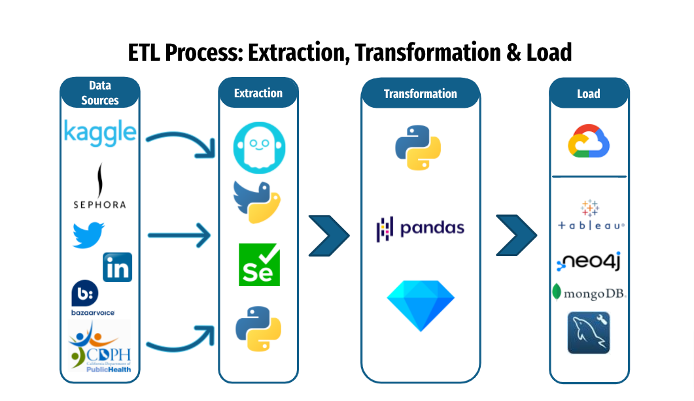
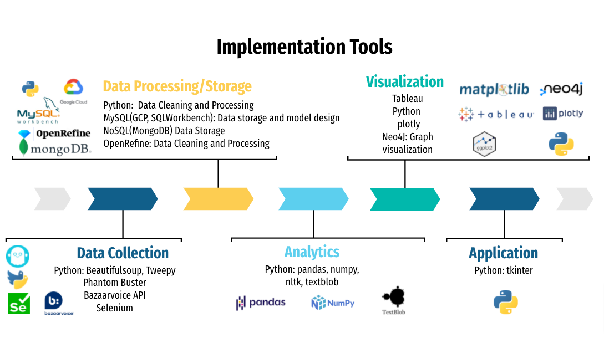

# Analysis On Beauty Industry

## Team
Ahjeong Yeom, Kenji Laurens, Steve Shi And Vanessa Li

## Project Summary
Our goal is to bring more meaningful and multi-dimensional data to users on cosmetic brands and products so that both brands and end-consumers can make informed decisions  

**Data Collection:** utilize different tools such as Tweepy API, XHR requests to extract product, twitter, brands, reviews and ingredient data from various sources

**Data Cleaning:**  utilize Python and OpenRefine to clean data and make them ready to import into MySQL

**Data Storage:** database is stored in cloud (GCP) to allow multiple remote collaborators and MySQL Workbench was chosen as GUI tool

**Data Model:** EER and dimensional model created 

**Data Analysis:** utilize SQL, Pandas, NLP libraries to perform analysis

**Data Visualization On 5 Business Use Cases：**
- Brand Perception Based On Sentiment Of Tweets
- Key Performance
- User Journey On Demo App Built On Tkinter
- Competitor Lookup
- Customer Demographic and Attribute Distribution

## ETL Process

## Implementation Tools

## Project Folder Structure
### BI Folder
- Case1_Brand_Perception_Tweet.ipynb
- Case2_Product_Performance_Tableau.twb
- Case3_Tkinter_App.ipynb
- Case4_Competitor_Lookup.twbx
- Case5_Product_Review_Plotly.ipynb

### Docs Folder
- Team5_Analysis_On_Beauty_Industry.pptx
- Team5_Analysis_On_Beauty_Industry.pdf

### Scripts Folder
#### Data Cleanup Transformation
- General_Dataset_Cleanup.ipynb
- Ingredients_Dataset_Cleanup.ipynb
- MongoDB_Import.ipynb
- Tweet_Cleanup_Sentimental_Analysis.ipynb
- Tweet_Location_Cleanup.ipynb

##### Data Collection
- Sephora_Product_Review.ipynb
- Selenium_Scraper.ipynb
- Tweepy_Scraper.ipynb

##### MongoDB
- reviews_mongo.csv

##### Neo4j
- 1-P139005.rtf
- 2_P455894.rtf
- 3_P447163.rtf
- 4_P441803.rtf

##### SQL
- EER_diagram.png
- Dimensional _Diagram.png
